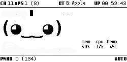

# bt-tether-multi

This is a custom Pwnagotchi plugin for Bluetooth tethering with multiple fallback phones and WAN verification.

## Features

- Rotates through multiple configured phones when internet is unavailable
- Verifies WAN access via curl to https://www.google.com with timeout
- Prioritizes phones based on the order in the configuration
- Prevents rapid looping with retry delay
- Displays current connection status in the UI

## Security Audit

This plugin has been scanned with [Bandit](https://github.com/PyCQA/bandit) for Python security issues and passes with **0 high, medium, or low severity findings**.

- Avoids all subprocess injection vectors by resolving full binary paths using `shutil.which()`
- Does **not** use `shell=True`
- All subprocess commands are passed as argument lists

To run Bandit:
```bash
bandit -r bt_tether_multi.py
```

## Installation

1. Place `bt-tether-multi.py` in the Pwnagotchi plugin directory:

   ```bash
   /usr/local/share/pwnagotchi/custom-plugins/bt-tether-multi.py
   ```

2. Edit `/etc/pwnagotchi/config.toml` and add:

   ```toml
   [main.plugins.bt-tether-multi]
   enabled = true
   phones = [
       { name = "PhoneA", mac = "00:11:22:33:44:55", ip = "192.168.44.45", type = "android" },
       { name = "PhoneB", mac = "AA:BB:CC:DD:EE:FF", ip = "192.168.44.146", type = "android" },
       { name = "PhoneC", mac = "AA:BB:CC:00:11:22", ip = "172.20.10.6", type = "ios" }
   ]

   main.custom_plugins = "/usr/local/share/pwnagotchi/custom-plugins/"
   ```

3. Restart Pwnagotchi or reload the plugin via webcfg.

## UI Display

The plugin shows the connection status at the top center of the screen:

- `B:<name>` — Connected to a known phone
- `...` — Trying to connect or rotating phones
- `X` — Disconnected
- `B:???` — Connected but phone not recognized
- `!` — Configuration or runtime error

## Example Output on Pwnagotchi Screen

The plugin updates the top center of the Pwnagotchi UI to reflect the currently connected Bluetooth tethering device.

Example:
`BT B: Apple` indicates that the device is using the second configured phone for Bluetooth tethering.



## Notes

- Requires `nmcli` for connection management
- WAN is considered "up" if curl to `https://www.google.com` succeeds with a 3s timeout
- Retry delay is enforced to reduce battery and system churn (default: 120 seconds)

## License

GPLv3

## Author

Plugin by [rivassec](https://github.com/rivassec)

